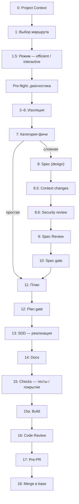
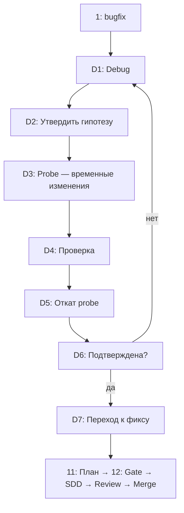

# maestro

Система оркестрации сквозной реализации фич и багфиксов в целевом приложении
через OpenCode. Pipeline от дизайна до мержа: ** brainstorm → spec → plan → SDD → review → docs ** —
с HITL-гейтами на ключевых точках.

> Это **authoring-репозиторий** (источник скиллов, агентов, команд). Нет приложения — скопируйте
> `.opencode/`, `skills/`, `commands/` и плагин в целевой проект (см.
> [Документация](manual_docs/index.md)).

## Что это

| Компонент | Описание |
|---|---|
| **Скилл `maestro`** | Спецификация pipeline (фичи / багфиксы / баг-дебаг) — `skills/maestro/SKILL.md` |
| **Команда `/maestro`** | Точка входа — загружает скилл и стартует pipeline |
| **Субагенты** | `design`, `haiku`, `sonnet`, `opus`, `fable`, `code-reviewer`, `sanitizer` |
| **Плагин** | `maestro-bootstrap` — санитайзинг промптов, file access control, audit-логи |
| **Команды** | `/maestro`, `/maestro-init`, `/maestro-design`, `/regression`, `/test-*` |

## Быстрый старт

### 1. Настройте проект

Скопируйте `.opencode/`, `skills/`, `commands/` и плагин в **целевой проект**. Затем:

| Шаг | Что сделать |
|---|---|
| `/maestro-init` | Создаёт `project-context.md`, `maestro.json`, `.gitignore`, каталоги `.maestro/`, `regression/` |
| `/maestro-design` | Дизайн + spec + scaffold + roadmap (для новых проектов) |

**Варианты:**

- **Новый проект:** `/maestro-init` → `/maestro-design` → `/maestro`
- **Существующий:** `/maestro-init` сам детектирует context и merge-ит конфиги

Или собрать вручную:

- [`docs/project-context.md`](manual_docs/explanation/project-context.md) — 14 категорий контекста (стек, архитектура, секция Commands)
- [`maestro.json`](#maestrojson) — trust, access_policy, sanitizer_whitelist
- [`opencode.json`](#opencodejson) — регистрация плагина + модели агентов
- `.gitignore` — `.maestro/sdd/`, `.maestro/last-run.md`, `.maestro/logs/`
- `regression/` — реестр рисков регрессии

### 2. Запустите pipeline

В любой сессии OpenCode:

```bash
/maestro "Реализуй экспорт в CSV с пагинацией"
```

Оркестратор проведёт через HITL-гейты: контекст → pre-flight → категория фичи → spec (если сложная) → план → реализация → ревью → merge.

### Быстрый маршрут для простых фич

Для небольших задач на 1-2 файла spec можно пропустить: категория **простая**
→ маршрут `0→6→7(b)→11→13→16→18`.

## Подход к разработке

Вход — команда `/maestro`. Оркестратор проходит через последовательность **HITL-гейтов** — явных вопросов с вариантами (a)/(b)/(c), на каждом гейте пользователь подтверждает действие.

### Feature-маршрут (0–18)

| # | Шаг | Назначение | Детали |
|---|---|---|---|
| 0 | Project Context | Загрузка контекста проекта | [0](manual_docs/explanation/step-0-project-context.md) + [14 categories](manual_docs/explanation/project-context.md) |
| 1 | Выбор маршрута | Feature или bugfix | [1](manual_docs/explanation/step-1-route-selection.md) |
| 1.5 | Режим | Efficient или interactive | [1.5](manual_docs/explanation/step-15-interaction-mode.md) |
| 2–6 | Pre-flight и изоляция | Диагностика → рабочая ветка | [2–6](manual_docs/explanation/step-2-6-preflight-isolation.md) |
| 7 | Категория фичи | Простая / Сложная / Архитектурная | [7](manual_docs/explanation/step-7-feature-classification.md) + [Classification](manual_docs/reference/feature-classification.md) |
| 8 | Spec (design) | Формирование spec-файла | [8](manual_docs/explanation/step-8-spec-formation.md) |
| 8.5 | Context changes | Оценка изменений контекста | — |
| 8.6 | Security review | Sanitizer проверяет spec | [agents-and-trust](manual_docs/explanation/agents-and-trust.md) |
| 9 | Spec Review | Независимый ревью от opus | [9](manual_docs/explanation/step-9-spec-review.md) |
| 10 | Spec gate | Утвердить / доработать / отмена | [hitl-gates — step 10](manual_docs/reference/hitl-gates.md) |
| 11 | Plan | Создание плана задач | [11](manual_docs/explanation/step-11-implementation-plan.md) |
| 12 | Plan gate | Утверждение плана | [hitl-gates — step 12](manual_docs/reference/hitl-gates.md) |
| 13 | SDD | Реализация с per-task review | [13](manual_docs/explanation/step-13-sdd.md) |
| 14 | Docs | Обновление пользовательской документации | [14](manual_docs/explanation/step-14-documentation.md) |
| 15 | Checks | Тесты, coverage, lint | [15](manual_docs/explanation/step-15-checks.md) |
| 15a | Build | Проверка сборки | [15](manual_docs/explanation/step-15-checks.md) |
| 16 | Code Review | Финальное ревью ветки | [16](manual_docs/explanation/step-16-code-review.md) |
| 17 | Pre-PR | Итоговая проверка перед merge | [hitl-gates — pre-pr](manual_docs/reference/hitl-gates.md) |
| 18 | Merge | Слияние в base | [18](manual_docs/explanation/step-18-merge.md) |



### Bugfix-маршрут (0–6 → D1–D7 → 11–18)

Bugfix пропускает steps 7–10 (spec/spec review), заменяя их debug-subpipeline. После D7 переходит к шагу 11 (`Plan → SDD → Review → Merge`).

| # | Шаг | Назначение | Детали |
|---|---|---|---|
| D1 | Debug | Систематический research кода и логов | [debug](manual_docs/explanation/debug-sub-pipeline.md) |
| D2 | Гипотеза | Утверждение версии бага | [debug — D2](manual_docs/explanation/debug-sub-pipeline.md) |
| D3 | Probe | Временные изменения для проверки | — |
| D4 | Проверка | Тесты/логи — подтвердилась? | — |
| D5 | Откат | Возврат к исходному состоянию | — |
| D6 | Подтверждение | Гипотеза подтверждена? | [hitl-gates — bugfix](manual_docs/reference/hitl-gates.md) |
| D7 | Переход к фиксу | Начинаем планирование | [debug — D7](manual_docs/explanation/debug-sub-pipeline.md) |



## Агенты и tiers

| Агент | Tier | Роль | Trusted? |
|---|---|---|---|
| `design` | opus | Spec formation, архитектура | ✅ |
| `sanitizer` | — | Security review, masking | ✅ |
| `opus` | opus | Spec review, code review | |
| `code-reviewer` | opus | Финальное ревью ветки | |
| `sonnet` | sonnet | Интеграционные задачи, task review | |
| `haiku` | haiku | Механические задачи (1-2 файла) | |
| `fable` | fable | Примеры, метафоры, объяснения | |

## Конфигурация

### maestro.json

Единый конфиг проекта (корень репо):

```json
{
  "trust": {
    "design": true,
    "sanitizer": true
  },
  "access_policy": {
    "version": 1,
    "default": "ask",
    "allow": ["src/**", "test/**"],
    "ask": ["docs/**", "*.config.*"],
    "deny": ["*.env", "*.{pem,key,cert}"]
  },
  "sanitizer_whitelist": {
    "rules": { "env_secret": true, "data_field": true, "db_credential": true },
    "extra_fields": [],
    "extra_uri_schemes": []
  }
}
```

| Секция | Назначение |
|---|---|
| `trust` | Кто trusted (skip sanitize + file access control) |
| `access_policy` | File access control: `allow/ask/deny` пути |
| `sanitizer_whitelist` | Правила маскировки чувствительных данных |

### opencode.json

Модели агентов:

```json
{
  "agent": {
    "haiku": { "model": "akash/Qwen/Qwen3.6-35B-A3B" },
    "sonnet": { "model": "akash/deepseek-ai/DeepSeek-V4-Flash" },
    "opus": { "model": "akash/zai-org/GLM-5.2" },
    "fable": { "model": "akash/deepseek-ai/DeepSeek-V4-Flash" },
    "design": { "model": "akash/zai-org/GLM-5.2" },
    "code-reviewer": { "model": "akash/deepseek-ai/DeepSeek-V4-Flash-0731" },
    "sanitizer": { "model": "akash/Qwen/Qwen3.6-35B-A3B" }
  }
}
```

### Переменные окружения

| Переменная | По умолчанию | Описание |
|---|---|---|
| `MAESTRO_BOOTSTRAP_LOG_LEVEL` | `info` | Уровень логов: debug/info/warn/error |
| `MAESTRO_BOOTSTRAP_LOG_DIR` | `.maestro/logs` | Каталог для JSONL-логов |
| `MAESTRO_CONFIG` | `maestro.json` | Путь к консолидированному конфигу |

## Подключение плагина

В `opencode.json` целевого проекта:

```jsonc
// .opencode/opencode.json или opencode.json
{
  "plugin": [
    "./plugins/maestro-bootstrap/index.js"
  ]
}
```

Перезапустите OpenCode. Плагин создаст `.maestro/` с JSONL-логами.

## Security и Sanitizer

Двухуровневая защита чувствительных данных (env-secrets, PII, credentials, PEM-ключи)
перед диспатчем в untrusted сабагенты.

```
untrusted диспатч →
  [Ур.1] плагин maestro-bootstrap — авто-маскирование, без HITL
  [Ур.2] сабагент sanitizer (trusted, read-only) — пометки + HITL
  → file access control (блокирует read ask/ deny файлов)
```

- `design` и `sanitizer` — **trusted** по умолчанию (skip sanitize + file access control)
- `maestro.json` → `trust` — расширяет trusted-список
- `access_policy` — `allow / ask / deny` пути для перехвата `read`
- Полная спецификация: [manual_docs/explanation/agents-and-trust.md](manual_docs/explanation/agents-and-trust.md)

## Команды

Все команды открываются через `/` в TUI (`@` — для упоминания агентов из `agents/`):

| Команда | Описание |
|---|---|
| `/maestro` | Вход в pipeline (фича/багфикс) |
| `/maestro-init` | Bootstrap: context + конфиг + scaffold + roadmap |
| `/maestro-design` | Дизайн проекта + spec + scaffold + roadmap |
| `/regression` | Прогон реестра регрессионных рисков |
| `/test-haiku` … `/test-opus` | Тесты сабагентов |
| `/maestro-feedback-report` | Генерация отчёта обратной связи |

## Рекомендации по моделям

Модели настраиваются в `opencode.json`. **Tier** (мощность) и **Trust** (доверие) —
ортогональные оси: trusted = атрибут безопасности, не мощность.

| Агент | Рекомендуемый tier | Зачем | Пример модели |
|---|---|---|---|
| `haiku` | быстрая/дешёвая | Механические задачи, 1-2 файла | `Qwen3.6-35B` |
| `sonnet` | средняя/сбаланс. | Интеграционные, multi-file, debugging | `DeepSeek-V4-Flash` |
| `opus` | мощная | Spec review, code review, архитектура | `GLM-5.2` |
| `design` | opus-tier | Spec formation, brainstorming (trusted) | любая opus |
| `sanitizer` | безопасная/sec | Security review — видит сырые данные (trusted) | безопасная/дефолтная |
| `fable` | творческая | Примеры, метафоры, объяснения | `DeepSeek-V4-Flash` |
| `code-reviewer` | opus-tier | Финальное ревью всей ветки | `DeepSeek-V4-Flash-0731` |

> `maestro-init` предложит модели из доступных в проекте + git-истории. Выбор — 7
> отдельных HITL-вопросов, с fallback на ручной ввод.
>
> Полный справочник: [manual_docs/reference/model-selection.md](manual_docs/reference/model-selection.md)

## Docs

Полная документация скилла `maestro` в [manual_docs/](manual_docs/index.md):

- [Быстрый старт](manual_docs/overview/quick-start.md)
- [Настройка проекта](manual_docs/tutorials/setup-project.md)
- [Запуск первой фичи](manual_docs/tutorials/run-first-feature.md)
- [Багфикс](manual_docs/how-to/run-a-bugfix.md)
- [Регрессионный реестр](manual_docs/how-to/use-regression-registry.md)
- [Кастомизация скилла](manual_docs/how-to/customize-maestro.md)

## Структура

```
agents/          — конфиги субагентов (design, haiku, sonnet, opus, fable, code-reviewer, sanitizer)
commands/        — @command конфиги (/maestro, /maestro-init, /regression, /test-*)
plugins/         — maestro-bootstrap (ESM-плагин: sanitize, access_policy, observability)
skills/          — скиллы (maestro, maestro-init, maestro-design, manual-docs)
specs/           — дизайн-спеки и план-ы этого репо (never in root!)
manual_docs/     — пользовательская документация скилла (Diátaxis)
```

## Синхронизация

`skills/`, `agents/`, `commands/` здесь — **источник истины**. Runtime-копии
живут в целевом приложении:

```
authors/repo              →  target/app
skills/maestro/SKILL.md   →  .opencode/skills/maestro/SKILL.md
agents/haiku.md           →  .opencode/agents/haiku.md
commands/maestro.md       →  .opencode/commands/maestro.md
```

Изменили источник → обновите копию.

## Тесты плагина

```bash
node --test plugins/maestro-bootstrap/index.test.js
# или из каталога:
cd plugins/maestro-bootstrap && npm test
```

---

> **Russian — working language.** Все HITL-гейты, сообщения пользователю и
> документация на русском. New content follows this convention.
