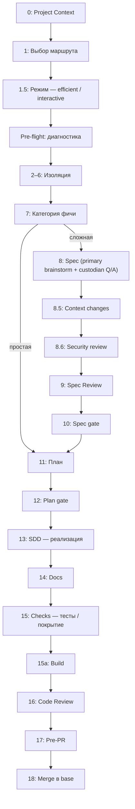
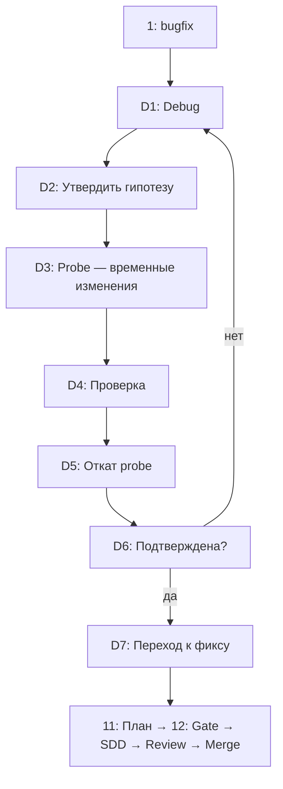

# Всё: pipeline — Feature и Bugfix

[Назад к оглавлению](../index.md)

## 🎯 Назначение

Сквозной обзор pipeline скилла `maestro`: что происходит от входа `/maestro` до мержа в base. Двухуровневый режим:

1. **Feature-маршрут** (полный, 0–18) — для фич от brainstorm до merge.
2. **Bugfix-маршрут** (0–6 + D1–D7 + 11–18) — багфикс без spec/spec review, с debug sub-pipeline.

Вход — команда `/maestro` в любой primary-сессии. Оркестратор проходит через
**HITL-гейты** — явные вопросы с вариантами (a)/(b)/(c), на каждом гейте пользователь подтверждает действие.

> Полная спецификация — `skills/maestro/SKILL.md`. Здесь — пользовательский обзор «как устроен pipeline и почему».

---

## Feature-маршрут (0–18)

### Предисловие

Пользователь вызывает `/maestro` с описанием задачи. Оркестратор загружает
project context, запускает pre-flight, определяет категорию фичи, и проходит
через pipeline (зависит от категории — простая или сложная).

**Быстрый маршрут для простых фич:** категория **простая** (1-2 файла) →
шаги `0→2→6→7(b)→11→13→16→18`. Spec (8–10) и Spec Review пропускаются.
Сжатая запись опускает шаги 14/15/15a для краткости; для простых фич
пропускаются только шаги 8-10 — **шаг 14 (документация) обязателен** для
всех категорий.

### Шаг за шагом

| # | Шаг | Назначение |
|---|---|---|
| 0 | Project Context | Загрузка проекта контекста из `docs/project-context.md` (или создание через HITL) |
| 1 | Выбор маршрута | Feature / Bugfix / Spike? Определяет дальнейший путь. Spike — feasibility/ресеч, без spec/plan/мержа. |
| 1.5 | Режим работы | Efficient (молчит между гейтами) / Interactive (комментирует находки) |
| 2–6 | Pre-flight и изоляция | Диагностика рабочего дерева → создание рабочей ветки → изоляция (worktree/checkout) |
| 7 | Категория фичи | Простая / Сложная / Архитектурная — определяет глубину pipeline (см. [Классификация фич](../reference/feature-classification.md)) |
| 8 | Spec Formation | Primary ведёт brainstorm (superpowers:brainstorming) + `custodian` (trusted, Q/A по confidential, без значений) → **spec пишет primary**, помечает фрагменты `из confidential` |
| 8.5 | Context changes | Оркестратор оценивает, изменил ли spec проект контекст + фиксирует spec-follow-up. Применяется после аппрува плана. |
| 8.6 | Security Review | Сабагент `sanitizer` (trusted) проверяет spec на чувствительные данные. При находках → HITL: вычистить / принять риск / стоп. Полный прогон — на первичной записи и при вовлечении trusted-контура (OQ-2) |
| 9 | Spec Review | Независимый ревью spec от `opus` (untrusted, read-only). Для арх. фич — обязателен |
| 10 | Spec gate | Approve → к плану · Revise → правки opus + оркестратор применяет (Ур.1), повторный review; 8.6 только при trusted-контуре · Reject → стоп. Особый случай (нужен confidential) → HITL custodian/follow-up |
| 11 | Plan | Создание плана задач: tasks, Project Context Changes, spec-follow-up, regression risk |
| 12 | Plan gate | Approve (коммит spec+plan+regression-entry) · Revise · Cancel |
| 13 | SDD | Реализация: субагенты haiku/sonnet по сложности, per-task review (sonnet), progress log |
| 14 | Docs | Обязательное обновление пользовательской документации: diff-сверка кода с manual_docs/; HITL только при расхождении. Coverage — на шаге 15 |
| 15 | Checks | Тесты (TEST_COMMAND), e2e, coverage (docs/obs), lint |
| 15a | Build | Проверка компиляции (BUILD_COMMAND) |
| 16 | Code Review | Финальное ревью всей ветки (`code-reviewer`, opus-tier). Secret-scan diff. Трекинг issues: fixed / open + follow-up |
| 17 | Pre-PR | Итоговая проверка: git log, тесты, coverage, открытые issues. Approve merge · Fix (→ шаг 13) · Cancel |
| 18 | Merge | Слияние feature-ветки в base-ветку. При fast-forward доп. тесты не нужны |

> Подробнее: [HITL-гейты](../reference/hitl-gates.md), [Агенты и доверие](../explanation/agents-and-trust.md), [Конфигурация](../reference/config.md).

### Диаграмма

---

## Bugfix-маршрут (0–6 → D1–D7 → 11–18)

Bugfix **пропускает** шаги 7–10 (spec/spec review), заменяя их debug sub-pipeline.
После D7 переходит к шагу 11 (`Plan → SDD → Review → Merge`).

### Debug sub-pipeline: D1—D7

| Шаг | Действие | HITL? |
|---|---|---|
| D1 | Systematic-debugging: ресерч кода, логов, воспроизведение | — |
| D2 | Утвердить гипотезу | Да: (a) да → probe · (б) новая гипотеза → D1 |
| D3 | Probe: временные изменения в файлы для проверки | — |
| D4 | Проверка гипотезы: тесты, логи, подтвердилась? | — |
| D5 | Откат probe-изменений: всегда, независимо от результата | — |
| D6 | Гипотеза подтверждена окончательно? | Да: (a) да → D7 · (б) нет → D1 |
| D7 | Переход к формальному плану фикса | Да: (a) да → шаг 11 · (б) отмена → стоп |

> `.probe-changes.md` — под gitignore (не коммитится). После D5 git status
> показывает diff фикса, не probe.

### Диаграмма

### Почему debug sub-pipeline

При багфиксе spec (шаг 8) не нужен — проблема уже известна. Вместо дизайна
используется `systematic-debugging` саб-пайплайн: ресерч → гипотеза → probe
→ откат → фикс. Откат критичен — probe-код не должен остаться в ветке.

---

## Почему pipeline устроен так

### HITL-гейты на ключевых точках

Стоимость ошибки растёт по мере продвижения: архитектурная ошибка на шаге 16
(code review) стоит в разы дороже, чем на шаге 8 (spec). Гейты сдвигают
выявление проблем как можно раньше — на spec-уровне, до строки кода.

### Три слоя ревью (не дублируют)

- **Spec Review (шаг 9):** до кодирования, оценивает архитектуру и риски spec.
- **Task review (шаг 13):** per-task код-гейт во время реализации, узкий scope.
- **Code Review (шаг 16):** финальный ревью всей ветки, ловит cross-task проблемы.

### Реестр регрессии

`regression/` фиксирует риск перед SDD на шаге 11, после реализации сверяет
сценарии с кодом (шаг 13f). Cross-feature агрегация через `/regression`.

---

## Связанные разделы

- [Классификация фич](../reference/feature-classification.md) — как определяется категория фичи
- [HITL-гейты](../reference/hitl-gates.md) — полный перечень гейтов
- [Агенты и доверие](../explanation/agents-and-trust.md) — trusted/untrusted, security review
- [Конфигурация](../reference/config.md) — maestro.json, .opencode/opencode.json, env vars
- [Команды](../reference/commands.md) — доступные команды
- [Запуск первой фичи](../tutorials/run-first-feature.md) — пошаговый проход с объяснениями
- [Запуск багфикса](../how-to/run-a-bugfix.md) — debug sub-pipeline детальнее
