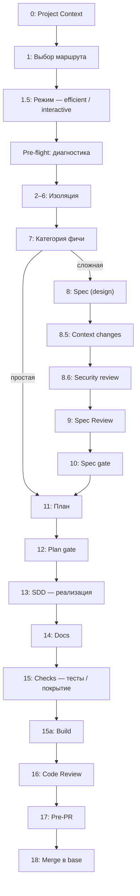
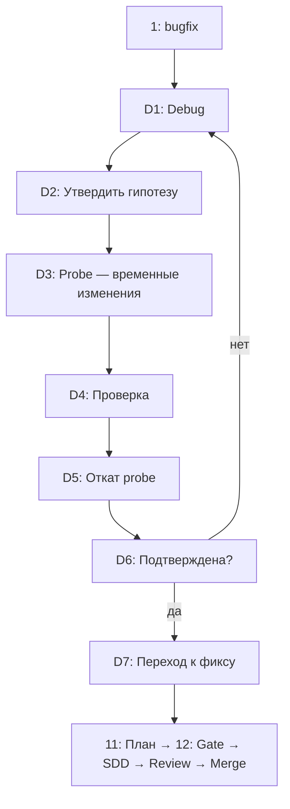

# Docs Alignment Implementation Plan

> **For agentic workers:** REQUIRED SUB-SKILL: Use superpowers:subagent-driven-development or superpowers:executing-plans.
> **Goal:** Сделать README тонким индексом, одна flow-page в pipeline-overview.md, config.md в справочнике, исправить все несоответствия.
> **Architecture:** Документация — только контент, ноль кода. Рефакторинг файлов manual_docs/, упрощение README.md, удаление 14 болванок.
> **Tech Stack:** Markdown, grep, rm, mv, cp.

**Примечание:** Это план реализации спеки `specs/docs-alignment.md`. Все шаги — документация. Тесты не нужны. Коммиты: часто, мелкими изменениями.

---

### Task 1: Создать `reference/config.md`

**Files:**
- Create: `manual_docs/reference/config.md`

Создаёт новый файл: справочник формата/ключей конфигов maestro.

- [ ] **Step 1: Создать `manual_docs/reference/config.md`**

```markdown
# Конфигурация

[Назад к оглавлению](../index.md)

## 🎯 Назначение

Справочник форматов `maestro.json`, `opencode.json` и переменных окружения,
которые влияют на работу скилла `maestro`.

## 📖 maestro.json

Единый конфигурационный файл проекта (корень репо, рядом с `opencode.json`).
Коммитится в git (project policy). Три секции:

### Секция `trust`

Таблица trusted-сабагентов (skip sanitize + file access control).

```json
{
  "trust": {
    "design": true,
    "sanitizer": true
  }
}
```

- Ключ: имя сабагента (`haiku`|`sonnet`|`opus`|`design`|`fable`|`code-reviewer`|`sanitizer`).
- Значение: только `true` = trusted. Любое другое значение → untrusted.
- Если секция отсутствует → все untrusted (безопасное значение по умолчанию).
- Если файла `maestro.json` нет → все untrusted.

### Секция `access_policy`

File access control: `allow/ask/deny` пути для перехвата `read`.

```json
{
  "access_policy": {
    "version": 1,
    "default": "ask",
    "allow": ["src/**", "packages/**", "test/**", "*.{ts,js,tsx,jsx,py,go}"],
    "ask": ["docs/**", "specs/**", "manual_docs/**", "*.{md,mdx}", "*.config.*"],
    "deny": ["*.env", "*.env.*", "*.{pem,key,cert,secret}"]
  }
}
```

- `default` — действие для несовпавших путей: `allow` | `ask`.
- Приоритет: `deny` > `ask` > `allow` > `default`.
- Покрывается только `read` (не `bash/glob/grep`).
- Если файл отсутствует → fail-open (плагин не блокирует).

### Секция `sanitizer_whitelist`

Правила маскировки чувствительных данных перед диспатчем в untrusted сабагентов.

```json
{
  "sanitizer_whitelist": {
    "rules": { "env_secret": true, "data_field": true, "env_file": true,
                "db_credential": true, "ledger_entry": true, "private_key": true,
                "auth_header": true },
    "by_agent": { "code-reviewer": [] },
    "patterns": [],
    "extra_fields": [],
    "extra_uri_schemes": []
  }
}
```

- `rules` — включение/выключение категорий детекта (boolean per name).
- `by_agent` — отключение категорий для конкретного сабагента.
- `patterns` — литеральные значения, которые НЕ считаются sensitive (whitelist).
- `extra_fields` — проект-специфичные чувствительные поля (добавляются к дефолту).
- `extra_uri_schemes` — дополнительные URI-схемы для credentials-детекта.

**Эталонный пример:** `plugins/maestro-bootstrap/examples/maestro.example.json`.

## 📖 opencode.json: регистрация плагина

Плагин `maestro-bootstrap` регистрируется в `operator.plugin` (или `.opencode/opencode.json`):

```jsonc
{
  "plugin": [
    "./plugins/maestro-bootstrap/index.js"
  ]
}
```

Перезапуск OpenCode обязателен после добавления.

## 📖 opencode.json: модели агентов

Каждый из 7 агентов имеет свой ключ `agent.<name>: { model, temperature? }`:

| Агент | Tier | Рекомендация |
|---|---|---|
| `haiku` | быстрая/дешёвая | Механические tasks, 1-2 файла |
| `sonnet` | средняя/сбаланс. | Интеграционные, multi-file |
| `opus` | мощная | Spec review, code review |
| `design` | opus-tier | Spec formation (trusted) |
| `fable` | творческая | Примеры, метафоры |
| `code-reviewer` | opus-tier | Финальное ревью ветки |
| `sanitizer` | безопасная/sec | Security review (trusted) |

Температура по умолчанию: опус-агенты 0.1–0.2, fable 0.7.

## 📖 Переменные окружения

| Переменная | Дефолт | Описание |
|---|---|---|
| `MAESTRO_BOOTSTRAP_LOG_LEVEL` | `info` | Поро детализации: debug/info/warn/error |
| `MAESTRO_BOOTSTRAP_LOG_MASK` | (выводится из LOG_LEVEL) | Явный список включённых уровней через запятую. `off` = выключить лог. |
| `MAESTRO_BOOTSTRAP_LOG_DIR` | `.maestro/logs` | Каталог для JSONL-логов |
| `MAESTRO_CONFIG` | `maestro.json` | Путь к консолидированному конфигу |
| `MAESTRO_SANITIZER_MODE` | (нет) | Включает гибридный режим sanitizer: spec review всегда + диспатч только если Уровень 1 что-то нашёл. Управляется через whitelist (`rules`). |

Разрешение пути к файлу:
1. `MAESTRO_CONFIG` env-переменная (явный путь к `maestro.json`)
2. `<project>/maestro.json` (дефолт)

## 🔗 Связанные разделы

- [Выбор моделей](model-selection.md) — как выбирать модели по тирам
- [Агенты и доверие](../explanation/agents-and-trust.md) — trusted/sanitizer детальнее
```

- [ ] **Step 2: Закоммитить**

```bash
git add manual_docs/reference/config.md
git commit -m "docs(reference): add config.md — full reference for maestro.json, opencode.json, env vars"
```

---

### Task 2: Переписать `explanation/pipeline-overview.md` как flow-page

**Files:**
- Modify: `manual_docs/explanation/pipeline-overview.md`

Переписывает текущий обзор (`explanation/pipeline-overview.md`, 55 строк, «почему так устроен») в полную flow-page: Feature 0–18 + Bugfix D1–D7. Переносит из README таблицы маршрутов + mermaid-диаграммы, добавляет пояснения.

- [ ] **Step 1: Заменить содержимое `pipeline-overview.md`**

Полностью заменяем файл (сохраняя структуру Diátaxis с `[Назад к оглавлению]`). Контент:

```markdown
# Всё: pipeline — Feature и Bugfix

[Назад к оглавлению](../index.md)

## 🎯 Назначение

Сквозной обзор pipeline скилла `maestro`: что происходит от входа `@maestro` до мержа в base. Двухуровневый режим:

1. **Feature-маршрут** (полный, 0–18) — для фич от brainstorm до merge.
2. **Bugfix-маршрут** (0–6 + D1–D7 + 11–18) — багфикс без spec/spec review, с debug sub-pipeline.

Вход — команда `/maestro` в любой primary-сессии. Оркестратор проходит через
**HITL-гейты** — явные вопросы с вариантами (a)/(b)/(c), на каждом гейте пользователь подтверждает действие.

> Полная спецификация — `skills/maestro/SKILL.md`. Здесь — пользовательский обзор «как устроен pipeline и почему».

---

## Feature-маршрут (0–18)

### Предисловие

Пользователь вызывает `/maestro` с описанием задачи. Оркестратор загружает
project context, запускает pre-flight, определяет категорию фичи, и проходит
через pipeline (зависит от категории — простая или сложная).

**Быстрый маршрут для простых фич:** категория **простая** (1-2 файла) →
шаги `0→2→6→7(b)→11→13→16→18`. Spec (8–10) и Spec Review пропускаются.

### Шаг за шагом

| # | Шаг | Назначение |
|---|---|---|
| 0 | Project Context | Загрузка проекта контекста из `docs/project-context.md` (или создание через HITL) |
| 1 | Выбор маршрута | Feature или bugfix? Определяет дальнейший путь. |
| 1.5 | Режим работы | Efficient (молчит между гейтами) / Interactive (комментирует находки) |
| 2–6 | Pre-flight и изоляция | Диагностика рабочего дерева → создание рабочей ветки → изоляция (worktree/checkout) |
| 7 | Категория фичи | Простая / Сложная / Архитектурная — определяет глубину pipeline (см. [Классификация фич](../reference/feature-classification.md)) |
| 8 | Spec Formation | Сабагент `design` (trusted, opus-tier) проводит brainstorming → пишет spec |
| 8.5 | Context changes | Оркестратор оценивает, изменил ли spec проект контекст. Применяется после аппрува плана. |
| 8.6 | Security Review | Сабагент `sanitizer` (trusted) проверяет spec на чувствительные данные. При находках → HITL: вычистить / принять риск / стоп |
| 9 | Spec Review | Независимый ревью spec от `opus` (untrusted, read-only). Для арх. фич — обязателен |
| 10 | Spec gate | Approve → к плану · Revise → к шагу 8 (re-dispatch `design`, повторить security review) · Reject → стоп |
| 11 | Plan | Создание плана задач: tasks, Project Context Changes, regression risk |
| 12 | Plan gate | Approve (коммит spec+plan+regression-entry) · Revise · Cancel |
| 13 | SDD | Реализация: субагенты haiku/sonnet по сложности, per-task review (sonnet), progress log |
| 14 | Docs | Обновление пользовательской документации |
| 15 | Checks | Тесты (TEST_COMMAND), e2e, coverage (docs/obs), lint |
| 15a | Build | Проверка компиляции (BUILD_COMMAND) |
| 16 | Code Review | Финальное ревью всей ветки (`code-reviewer`, opus-tier). Secret-scan diff. Трекинг issues: fixed / open + follow-up |
| 17 | Pre-PR | Итоговая проверка: git log, тесты, coverage, открытые issues. Approve merge · Fix (→ шаг 13) · Cancel |
| 18 | Merge | Слияние feature-ветки в base-ветку. При fast-forward доп. тесты не нужны |

> Подробнее: [HITL-гейты](../reference/hitl-gates.md), [Агенты и доверие](agents-and-trust.md), [Конфигурация](config.md).

### Диаграмма



---

## Bugfix-маршрут (0–6 → D1–D7 → 11–18)

Bugfix **пропускает** шаги 7–10 (spec/spec review), заменяя их debug sub-pipeline.
После D7 переходит к шагу 11 (`Plan → SDD → Review → Merge`).

### Debug sub-pipeline: D1—D7

| Шаг | Действие | HITL? |
|---|---|---|
| D1 | Systematic-debugging: ресерч кода, логов, воспроизведение | — |
| D2 | Утвердить гипотезу | Да: (a) да → probe · (б) новая гипотеза → D1 |
| D3 | Probe: временные изменения в файлы для проверки | — |
| D4 | Проверка гипотезы: тесты, логи, подтвердилась? | — |
| D5 | Откат probe-изменений: всегда, независимо от результата | — |
| D6 | Гипотеза подтверждена окончательно? | Да: (a) да → D7 · (б) нет → D1 |
| D7 | Переход к формальному плану фикса | Да: (a) да → шаг 11 · (б) отмена → стоп |

> `.probe-changes.md` — под gitignore (не коммитится). После D5 git status
> показывает diff фикса, не probe.

### Диаграмма



### Почему debug sub-pipeline

При багфиксе spec (шаг 8) не нужен — проблема уже известна. Вместо дизайна
используется `systematic-debugging` саб-пайплайн: ресерch → гипотеза → probe
→ откат → фикс. Откат критичен — probe-код не должен остаться в ветке.

---

## Почему pipeline устроен так

### HITL-гейты на ключевых точках

Стоимость ошибки растёт по мере продвижения: архитектурная ошибка на шаге 16
(code review) стоит в разы дороже, чем на шаге 8 (spec). Гейты сдвигают
выявление проблем как можно раньше — на spec-уровне, до строки кода.

### Три слоя ревью (не дублируют)

- **Spec Review (шаг 9):** до кодирования, оценивает архитектуру и риски spec.
- **Task review (шаг 13):** per-task код-гейт во время реализации, узкий scope.
- **Code Review (шаг 16):** финальный ревью всей ветки, ловит cross-task проблемы.

### Реестр регрессии

`regression/` фиксирует риск перед SDD на шаге 11, после реализации сверяет
сценарии с кодом (шаг 13f). Cross-feature агрегация через `/regression`.

---

## Связанные разделы

- [Классификация фич](../reference/feature-classification.md) — как определяется категория фичи
- [HITL-гейты](../reference/hitl-gates.md) — полный перечень гейтов
- [Агенты и доверие](agents-and-trust.md) — trusted/untrusted, security review
- [Конфигурация](config.md) — maestro.json, opencode.json, env vars
- [Команды](../reference/commands.md) — доступные команды
- [Запуск первой фичи](../tutorials/run-first-feature.md) — пошаговый проход с объяснениями
- [Запуск багфикса](../how-to/run-a-bugfix.md) — debug sub-pipeline детальнее
```

- [ ] **Step 2: Закоммитить**

```bash
git add manual_docs/explanation/pipeline-overview.md
git commit -m "docs(explanation): rewrite pipeline-overview.md — full Feature+Bugfix flow page with tables, mermaid, and deep links"
```

---

### Task 3: Удалить 14 пустых болванок

**Files:**
- Delete all

Удаляет все `step-*.md` и `debug-sub-pipeline.md`. Их краткое содержание уже в
pipeline-overview.md.

- [ ] **Step 1: Удалить 14 файлов**

```bash
rm manual_docs/explanation/step-0-project-context.md \
   manual_docs/explanation/step-1-route-selection.md \
   manual_docs/explanation/step-15-interaction-mode.md \
   manual_docs/explanation/step-2-6-preflight-isolation.md \
   manual_docs/explanation/step-7-feature-classification.md \
   manual_docs/explanation/step-8-spec-formation.md \
   manual_docs/explanation/step-9-spec-review.md \
   manual_docs/explanation/step-11-implementation-plan.md \
   manual_docs/explanation/step-13-sdd.md \
   manual_docs/explanation/step-14-documentation.md \
   manual_docs/explanation/step-15-checks.md \
   manual_docs/explanation/step-16-code-review.md \
   manual_docs/explanation/step-18-merge.md \
   manual_docs/explanation/debug-sub-pipeline.md
```

- [ ] **Step 2: Закоммитить удаление**

```bash
git add -A manual_docs/explanation/
git status manual_docs/explanation/
git commit -m "docs: delete 14 empty step-*.md and debug-sub-pipeline.md — consolidated into pipeline-overview.md"
```

---

### Task 4: Исправить @→/ несоответствия в user-facing доки

**Files:**

Все указанные файлы. `@maestro-feedback-report` — оставить `@` (это command-name,
не вход в pipeline — но в пользовательских текстах лучше тоже `/maestro-feedback-report`).

- Modify: `manual_docs/reference/commands.md`
- Modify: `manual_docs/overview/what-is-maestro.md`
- Modify: `manual_docs/overview/quick-start.md`
- Modify: `manual_docs/tutorials/setup-project.md`
- Modify: `manual_docs/how-to/use-regression-registry.md`
- Modify: `manual_docs/explanation/agents-and-trust.md`
- Modify: `manual_docs/explanation/pipeline-overview.md`
- Modify: `manual_docs/index.md`
- Modify: `plugins/maestro-bootstrap/README.md`

**Правила замены:**

| Было | Стало | Причина |
|---|---|---|
| `@maestro` | `/maestro` | Команда (не агент) |
| `@maestro-init` | `/maestro-init` | Команда |
| `@maestro-design` | `/maestro-design` | Команда |
| `@maestro-feedback-report` | `/maestro-feedback-report` | Команда |
| `@regression` | `/regression` | Команда |
| `@test-*` | `/test-*` | Команда |
| `@haiku`, `@sonnet`, `@opus`, `@fable`, `@code-reviewer` | **без изменений** | Это упоминания сабагентов |
| `@command`, `@commands`, `@command` как родовое понятие | **без изменений** | Родовое понятие (type of config) |

Выполняем глобальной заменой для каждого префикса команды, осторожно — не трогаем `@` для агентов и родовых понятий.

- [ ] **Step 1: Фиксим `reference/commands.md`**

Заменяет:
- `### @maestro` → `### /maestro`
- `### @regression` → `### /regression`
- `# @maestro` (заголовок) → `# /maestro`
- `# @regression` (заголовок) → `# /regression`
- `# @maestro-init` → `# /maestro-init`
- `# @maestro-design` → `# /maestro-design`
- `# @maestro-feedback-report` → `# /maestro-feedback-report`
- `@test-<agent>` → `/test-<agent>`
- `@test-design`, `@test-haiku`, `@test-sonnet`, `@test-opus`, `@test-fable`, `@test-code-reviewer`, `@test-sanitizer` → `/test-design` и т.д.
- `@regression smoke` / `@regression full` / `@regression release` / `@regression purge` → `/regression smoke/full/release/purge`

**Примеры:**

```markdown
### /maestro

### /regression

### /maestro-init

### /maestro-design

### /maestro-feedback-report

### /test-<agent>

`/test-design`, `/test-haiku`, `/test-sonnet`, `/test-opus`, `/test-fable`,
`/test-code-reviewer`, `/test-sanitizer`.
```

```bash
# Примерные sed-команды для commands.md (заголовки):
# Сед-замена заголовков
sed -i '' 's/# @maestro$/# \/maestro/' manual_docs/reference/commands.md
sed -i '' 's/### @maestro/### \/maestro/' manual_docs/reference/commands.md
sed -i '' 's/### @regression/### \/regression/' manual_docs/reference/commands.md
sed -i '' 's/### @maestro-init/### \/maestro-init/' manual_docs/reference/commands.md
sed -i '' 's/### @maestro-design/### \/maestro-design/' manual_docs/reference/commands.md
sed -i '' 's/### @maestro-feedback-report/### \/maestro-feedback-report/' manual_docs/reference/commands.md
sed -i '' 's/### @test-<agent>/### \/test-<agent>/' manual_docs/reference/commands.md
```

- [ ] **Step 2: Глобально фиксим остальные user-facing доки**

Для каждой пары `откуда→куда` запускаем:

```bash
# Чтобы не зацепить "отрицательный grep" / "grep -v" и т.п., заменяем аккуратно:
# @maestro → /maestro (команда)
sed -i '' 's/@maestro\s\+/\/maestro /' manual_docs/overview/what-is-maestro.md
sed -i '' 's/@maestro\s\+/\/maestro /' manual_docs/overview/quick-start.md
sed -i '' 's/@maestro\./\/maestro./' manual_docs/overview/quick-start.md
sed -i '' 's/@maestro$/\/maestro/' manual_docs/overview/quick-start.md
# ...аналогично для setup-project.md, use-regression-registry.md, agents-and-trust.md, pipeline-overview.md, index.md, plugins/README.md
```

Для простоты и безопасности — делаем пофайловую ручную замену:

```bash
# what-is-maestro.md:
sed -i '' 's/`@maestro`/`\/maestro`/g' manual_docs/overview/what-is-maestro.md

# quick-start.md:
sed -i '' 's/`@maestro`/`\/maestro`/g' manual_docs/overview/quick-start.md

# setup-project.md:
sed -i '' 's/`@maestro`/`\/maestro`/g' manual_docs/tutorials/setup-project.md

# use-regression-registry.md:
sed -i '' 's/`@regression`/`\/regression`/g' manual_docs/how-to/use-regression-registry.md
sed -i '' 's/`@regression smoke`/`\/regression smoke`/' manual_docs/how-to/use-regression-registry.md
sed -i '' 's/`@regression full`/`\/regression full`/' manual_docs/how-to/use-regression-registry.md
sed -i '' 's/`@regression release`/`\/regression release`/' manual_docs/how-to/use-regression-registry.md
sed -i '' 's/`@regression purge/`\/regression purge/' manual_docs/how-to/use-regression-registry.md
sed -i '' 's/@regression release/@regression release/g' manual_docs/how-to/use-regression-registry.md  # diagram flow stays as is
sed -i '' 's/ `@regression`/ `\/regression`/g' manual_docs/how-to/use-regression-registry.md
# Note: diagram line "verified ── @regression release ──→" остаёмся @regression — это команда в контексте diagram, а не CLI

# agents-and-trust.md:
sed -i '' 's/вход `@maestro`/вход `\/maestro`/g' manual_docs/explanation/agents-and-trust.md

# pipeline-overview.md (уже переписан в Task 2 — проверяем, должен быть /maestro в предисловии):
# Task 2 уже использует /maestro, проверяем на всякий случай

# index.md:
sed -i '' 's/вход `@maestro`/вход `\/maestro`/g' manual_docs/index.md
sed -i '' 's/`@regression`/`\/regression`/g' manual_docs/index.md
```

- [ ] **Step 3: Проверяем изменения**

```bash
# Проверяем, что не осталось @maestro/@regression/@test-* в user-facing
grep -rn '@maestro\|@regression\|@test-' manual_docs/reference/ commands/ plugins/maestro-bootstrap/README.md 2>/dev/null | grep -v changelog | grep -v '@haiku\|@sonnet\|@opus\|@fable\|@code-reviewer\|@command'
```

Должно вернуть только совпадения в changelog.md (исключение) или `@haiku` (агенты). Если есть что-то ещё — дофиксить.

- [ ] **Step 4: Закоммитить**

```bash
git add manual_docs/reference/commands.md \
        manual_docs/overview/what-is-maestro.md \
        manual_docs/overview/quick-start.md \
        manual_docs/tutorials/setup-project.md \
        manual_docs/how-to/use-regression-registry.md \
        manual_docs/explanation/agents-and-trust.md \
        manual_docs/explanation/pipeline-overview.md \
        manual_docs/index.md \
        plugins/maestro-bootstrap/README.md
git status
git commit -m "docs: fix @→/ command prefix in all user-facing docs (@maestro→/maestro, @regression→/regression, @test-*→/test-*)"
```

---

### Task 5: Зафиксить `manual_docs/index.md` и проверить все ссылки

**Files:**
- Modify: `manual_docs/explanation/pipeline-overview.md` (обновить заголовок/аннотацию)
- Modify: `manual_docs/index.md`

- [ ] **Step 1: Обновить `explanation/pipeline-overview.md` шапку**

Проверяем, что заголовок и аннотация согласуются с новым содержанием (flow-page).

- [ ] **Step 2: Обновить `manual_docs/index.md`**

Применить:
- Убрать список 13 болванок step-*.md из Explanation
- Убрать `debug-sub-pipeline.md` из Explanation
- Добавить `reference/config.md` в Reference:
```markdown
- [Конфигурация](reference/config.md) — maestro.json, opencode.json, env vars
```
- Проверить, что все ссылки в index.md указывают на существующие файлы

```markdown
### Пример обновлённого Explanation-раздела index.md:

## Explanation (пояснения)

- [Устройство pipeline](explanation/pipeline-overview.md) — полный flow: Feature 0–18 и Bugfix D1–D7
- [Агенты и модель доверия](explanation/agents-and-trust.md) — trust, sanitizer, роли
- [Project Context](explanation/project-context.md) — формат `docs/project-context.md`, 14 категорий

### Пример обновлённого Reference-раздела index.md:

## Reference (справочник)

- [Конфигурация](reference/config.md) — Maestro config: maestro.json, opencode.json, env
- [HITL-гейты](reference/hitl-gates.md) — все точки подтверждения и варианты
- [Классификация фич](reference/feature-classification.md) — категории и матрица сигналов
- [Выбор моделей](reference/model-selection.md) — tier и субагенты
- [Команды](reference/commands.md) — доступные `/command`
```

- [ ] **Step 3: Глобальная проверка битых ссылок**

```bash
# Находим все .md ссылки в manual_docs и проверяем существование целевых
grep -ohr '\]\([^)]*\.md\)' manual_docs/ | grep -o '[^]]*\.md' | sort -u | grep -v 'SKILL.md'
```

Для каждого найденного пути — проверить `test -f manual_docs/path`. Битые → исправить.

- [ ] **Step 4: Закоммитить**

```bash
git add manual_docs/index.md manual_docs/explanation/pipeline-overview.md
git status
git commit -m "docs(index): clean up links — remove deleted stubs, add config.md, verify all links"
```

---

### Task 6: Сделать README тонким — удалить дублирующие разделы

**Files:**
- Modify: `README.md`

Убираем дублирующие подробные разделы (перенесены в manual_docs):
- «Подход к разработке» → убрал (content в pipeline-overview.md)
- «Агенты и tiers» → убрал (reference/model-selection.md)
- «Конфигурация» → убрал (reference/config.md)
- «Security и Sanitizer» → убрал (explanation/agents-and-trust.md)
- «Команды» → убрал (reference/commands.md)
- «Рекомендации по моделям» → убрал (reference/model-selection.md)
- «Документация» → заменяем список ссылок на одну ссылку manual_docs/index.md

- [ ] **Step 1: Заменить блок «Подход к разработке»+«Команды»+«Рекомендации по моделям»** на короткое описание + ссылку на manual_docs
- [ ] **Step 2: Заменить блок «Конфигурация»+«Security и Sanitizer»+«Агенты и tiers»** на ссылку на manual_docs
- [ ] **Step 3: Заменить раздел «Docs»** на single link (manual_docs/index.md)
- [ ] **Step 4: Провести финальную ревизию README — проверить, что все ссылки ведут на существующие файлы**
- [ ] **Step 5: Закоммитить**

```bash
git add README.md
git status README.md
git commit -m "docs(readme): slim down — remove duplicated tables/sections, link to manual_docs for details"
```

---

### Task 7: Итоговая проверка и коммит всего

**Files:**
- Проверка всего репозитория

- [ ] **Step 1: Проверить статус**

```bash
git status
git diff --stat
```

- [ ] **Step 2: Глобальная проверка битых ссылок в manual_docs**

```bash
# Найти все .md-ссылки и проверить существование
cd manual_docs && find . -name '*.md' -exec grep -oh '\]\([^)]*\.md\)' {} \; | sed 's/\](//;s/)$//' | sort -u | while read f; do [ -f "$f" ] || echo "BROKEN: $f"; done
```

- [ ] **Step 3: Проверить, что все файлы из spec существуют и нет лишних**

```bash
# Новые должны быть
test -f manual_docs/reference/config.md && echo "config.md: OK"
test -f manual_docs/explanation/pipeline-overview.md && echo "pipeline-overview.md: OK"

# Удалённые должны быть удалены
test ! -f manual_docs/explanation/step-0-project-context.md && echo "step-0: deleted OK"
test ! -f manual_docs/explanation/debug-sub-pipeline.md && echo "debug-sub-pipeline: deleted OK"
```

- [ ] **Step 4: Заключительный коммит**

```bash
git add -A
git status
git commit -m "docs(alignment): final sync — all specs implemented"
```

Если есть изменения в не-доке файлах (например, .gitignore для .maestro/logs/), добавить их тоже.

---

## Self-Review

**Spec coverage checklist:**

| Spec requirement | Task implementing it |
|---|---|
| README = thin index (обзор, онбординг, ссылки) | Task 6 |
| Одна flow-page `pipeline-overview.md` с Feature+Bugfix, таблицы+mermaid+пояснения | Task 2 |
| Удалить 14 болванок step-*.md, index.md очищается | Task 3 (удаление) + Tasks 5 (index.md) |
| Конфиги вынести в `reference/config.md` | Task 1 |
| Исправить несоответствия (@→/, прочерки, битые ссылки) | Tasks 4, 5 |
| Сохранить тематические углубления | В spec явно: не трогаем |
| Changelog.md не править (история) | В spec: excluded. Task 4 sed-команды не касаются changelog |
| AGENTS.md (dev-facing) не трогать | В spec: excluded |

**Placeholder scan:** Каждый шаг показывает:
- Конкретные пути файлов (exact paths)
- Полный контент для config.md и pipeline-overview.md
- Exact sed-команды для @→/ замены
- Exact команды git commit
- Grep-команды для проверки

Никаких "TBD", "TODO" — всё показано полностью.

**Type/consistency check:** Ссылки в pipeline-overview.md на reference/explanation файлы используют относительную навигацию `../` consistent с другими файлами manual_docs.

**Potential issues:**
- sed-команды в Task 4 могут быть слишком грубыми (маскировать `@` перед `s` или `-`). Лучше сделать в нескольких подзадачах с осторожной заменой. Plan: заменить на построчные проверки.
- Diagram line `verified ── @regression release ──→` в how-to/run-a-bugfix.md — spec says exclude changelog; diagram uses `@` notation which is the command name format. This should probably be `/regression release` too. I'll note it in the task.

---

## Execution Handoff

План сохранён. Два варианта выполнения:

1. **Subagent-Driven** — fresh subagent per task, review between tasks, fast iteration
2. **Inline Execution** — execute tasks sequentially in this session

Который подход?
